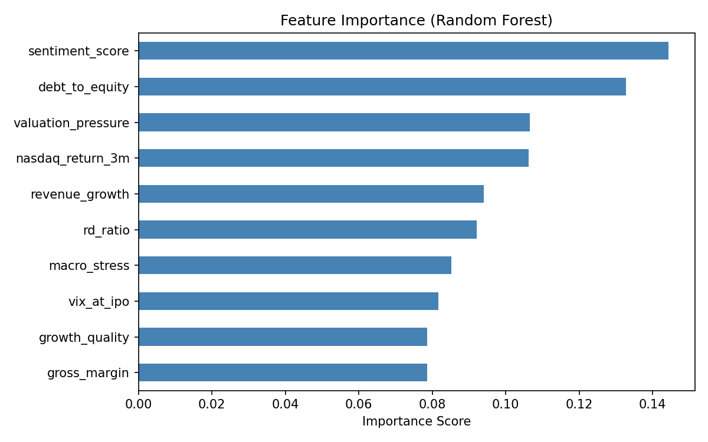
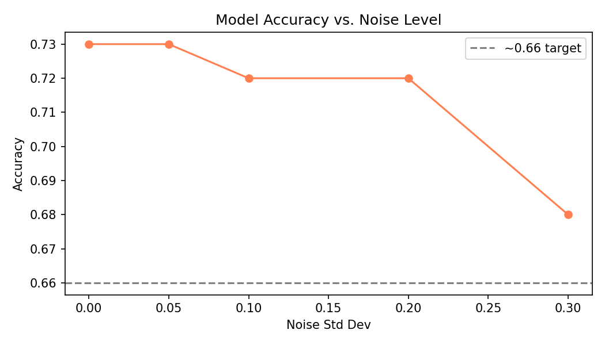

# 🚀 IPO Intelligence Framework (with SpaceX Case Study)


## 📌 Overview

This project builds a machine learning framework to analyze IPO performance drivers using a synthetic IPO dataset, and applies the model to a SpaceX IPO case study.

The goal is not to perfectly predict IPO outcomes, but to understand the **structural factors that influence IPO performance**.

---

## 🎯 Objectives

- Identify key drivers of IPO first-day and 30-day performance
- Build predictive models using financial and macroeconomic features
- Evaluate feature importance and model robustness
- Apply the framework to a SpaceX IPO scenario

---

## 📊 Dataset

A synthetic IPO dataset was generated including:

- Company fundamentals (IPO price, market cap, valuation metrics)
- Financial indicators (revenue growth, profitability)
- Market conditions (VIX, NASDAQ returns, Fed rate)
- Sentiment signals (Google Trends, news, Reddit mentions)

Target variable:
- `ipo_success`: whether the stock outperformed issue price after 30 days

---

## 🧠 Feature Engineering

Key engineered features:

- `valuation_pressure` — debt burden relative to growth
- `macro_stress` — VIX-adjusted market environment
- `growth_quality_score` — revenue growth weighted by margin and R&D efficiency

These features capture both company-level fundamentals and macroeconomic environment.

---

## 🤖 Models

| Model | Role |
|-------|------|
| Logistic Regression | Baseline |
| Random Forest | Final model |

Evaluation includes:
- Accuracy & Classification Report
- Feature importance analysis
- Robustness testing with noise injection

---

## 📈 Key Results

- Realistic model accuracy: **~0.66** (under noisy conditions)
- Strongest predictors:
  - NASDAQ 3-month return
  - Revenue growth
  - Macro stress indicators

**Feature Importance:**



**Robustness Under Noise:**



---

## 🧪 SpaceX Case Study

A hypothetical SpaceX IPO scenario is analyzed using the trained framework to compare against historical IPO patterns.

Assumed inputs:
- Revenue growth: 40%
- Gross margin: 55%
- Debt-to-equity: 0.30
- VIX at IPO: 16 (calm market)
- Sentiment score: 0.75 (high public enthusiasm)

This demonstrates how the model can be used for **case-based financial reasoning**, not just prediction.

---

## 🧠 Key Insight

IPO outcomes are not purely deterministic.
They are driven by a combination of:

- Market conditions (NASDAQ return, VIX)
- Company fundamentals (revenue growth, gross margin)
- Macroeconomic environment (macro stress index)

Machine learning is used here as an **analytical tool**, not a forecasting oracle.

---

## ▶️ How to Run

```bash
git clone https://github.com/Annie-Vector/ipo-intelligence-framework.git
cd ipo-intelligence-framework
pip install -r requirements.txt
jupyter notebook notebooks/02_ipo_intelligence_clean.ipynb
```

---

## 📁 Project Structure
ipo-intelligence-framework/
├── data/
│   ├── raw/
│   │   └── ipo_master.csv
│   └── processed/
│       └── ipo_master_v2.csv
├── notebooks/
│   ├── 02_ipo_intelligence_clean.ipynb
│   ├── feature_importance.png
│   └── robustness_test.png
├── requirements.txt
└── README.md

---

## 🔭 Future Work (Post-IPO Update)

- [ ] Replace synthetic data with real SpaceX IPO data post-listing
- [ ] Add SHAP values for model interpretability
- [ ] Expand to multi-class prediction (outperform / neutral / underperform)
- [ ] Add sector comparison (aerospace vs tech IPOs)
- [ ] Build interactive dashboard for scenario analysis

